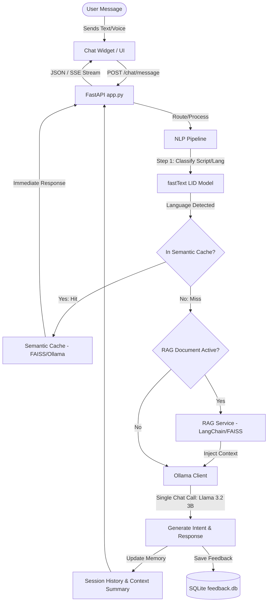

# 🤖 Multilingual Indian Language Chatbot

[](https://fastapi.tiangolo.com/)
[](https://ollama.com)
[](https://python.org)
[](LICENSE)

An intelligent, production-ready multilingual conversational agent supporting **Hindi, Bengali, Marathi, Tamil, Telugu, Kannada, and English**. 

Powered by **Ollama (Llama 3.2 3B)**, Facebook's **fastText** for instant language detection, and **LangChain** for Retrieval-Augmented Generation (RAG) and Semantic Caching.

---

## 🏗️ Architecture & Message Pipeline



---

## 📋 System Prerequisites

Ensure you have the following installed on your host system:

| Dependency | Purpose | Check Command |
| :--- | :--- | :--- |
| **Python 3.10+** | Runs the FastAPI application backend | `python --version` |
| **Ollama** | Local Large Language Model (LLM) execution engine | `ollama --version` |
| **Git** | Repository cloning and version control | `git --version` |

---

## 🚀 Easy Step-by-Step Setup Guide

Follow these steps carefully to run the chatbot on your local laptop.

### Step 1: Open the Project Directory
Launch your preferred shell (PowerShell or Command Prompt on Windows, Terminal on macOS/Linux) and navigate to the project directory:
```bash
cd "e:/MAAM/chatbot code - Copy"
```

### Step 2: Configure the Python Virtual Environment
Isolate your Python dependencies by creating and activating a virtual environment.

**On Windows (PowerShell/CMD):**
```powershell
# Create the virtual environment if it doesn't exist
python -m venv venv

# Activate the virtual environment
venv\Scripts\activate
```

**On macOS/Linux:**
```bash
# Create the virtual environment if it doesn't exist
python3 -m venv venv

# Activate the virtual environment
source venv/bin/activate
```

> [!TIP]
> When active, your terminal prompt will be prefixed with `(venv)`. Always ensure this is active before running application commands.

### Step 3: Install Required Dependencies
With the virtual environment active, install all required packages:
```bash
pip install -r requirements.txt
```

> [!WARNING]
> The installation might take a few minutes as package dependencies like `faiss-cpu`, `sentence-transformers`, and `SpeechRecognition` are large. Let it complete fully.

### Step 4: Download the fastText Language Detection Model
The system uses Facebook's fastText model (`lid.176.bin`) to detect languages instantly in 0ms without hitting the LLM. 

Download the model using the preconfigured helper script:
```bash
python scripts/data_collection/download_lid_model.py
```
This automatically downloads the model checkpoint (~126MB) and saves it into the correct directory (`models/language_detection/fasttext_lid/`).

---

## 🦙 Ollama Setup & Configuration

Ollama acts as the local inference engine running the Llama 3.2 model on your laptop.

### 1. Download & Install Ollama
- **Windows / macOS / Linux**: Download the installer from the [Official Ollama Download Page](https://ollama.com/download) and run it.
- **Verification**: Once installed, open a fresh terminal and run:
  ```bash
  ollama --version
  ```

### 2. Pull the Llama 3.2 3B Model
Start the Ollama application (ensure it is running in your taskbar/system tray) and download the required 3-Billion parameter Llama 3.2 model:
```bash
ollama pull llama3.2:3b
```
> [!IMPORTANT]
> The exact tag used in the source code is `llama3.2:3b`. If your connection fails or you wish to use a different tag, the client will fall back to querying the general `llama3.2` model.

### 3. Verify Model Availability
Verify that the model has successfully downloaded and is registered in Ollama:
```bash
ollama list
```
You should see output similar to this:
```
NAME            ID              SIZE      MODIFIED
llama3.2:3b     a80c4e17d75a    2.0 GB    2 minutes ago
```

---

## ⚡ Running the Chatbot

For the best development experience, it is highly recommended to run in a **Two-Terminal Setup**:

### Terminal 1: Run the Ollama Engine
Ensure Ollama is running and listening for local requests:
```bash
ollama serve
```
*(Leave this terminal window open to monitor GPU/CPU model loading and logs).*

### Terminal 2: Start the FastAPI Server
Activate your virtual environment and start the FastAPI uvicorn server:
```bash
# Make sure you are in the project folder and venv is active
venv\Scripts\activate

# Run the backend server
uvicorn app:app --reload --port 8000
```

Upon a successful startup, you will see the following logs:
```text
🚀 Starting Multilingual Chatbot Server...
✅ Knowledge Base loaded: 20 intents
✅ Ollama model loaded: llama3.2:3b
✅ FastText language detector loaded
✅ Server ready!
INFO:     Started server process [12345]
INFO:     Waiting for application startup.
INFO:     Application startup complete.
INFO:     Uvicorn running on http://127.0.0.1:8000 (Press CTRL+C to quit)
```

---

## 🌐 Accessing the Chatbot Interfaces

Once the FastAPI server is running, open your web browser and navigate to the following endpoints:

| Interface URL | Description |
| :--- | :--- |
| **[`http://localhost:8000`](http://localhost:8000)** | 💬 **Chat Widget**: The main end-user interactive chat interface. |
| **[`http://localhost:8000/docs`](http://localhost:8000/docs)** | 📖 **Swagger API Docs**: Test all endpoints interactively (like `/chat/message` or `/translate`). |
| **[`http://localhost:8000/admin`](http://localhost:8000/admin)** | ⚙️ **Admin Dashboard**: View chatbot analytics, active sessions, and manage intents. |
| **[`http://localhost:8000/health`](http://localhost:8000/health)** | 🩺 **System Health**: Check backend connectivity and Ollama status. |

---

## 🛠️ Troubleshooting & Common Issues

### ❌ `503 Service Unavailable: NLP Pipeline not ready`
- **Cause**: Ollama is either not running or the `llama3.2:3b` model has not been pulled.
- **Fix**: Open a terminal, run `ollama serve`, and in another terminal run `ollama pull llama3.2:3b`. Then restart the FastAPI app.

### ❌ `FileNotFoundError: Fasttext model not found at...`
- **Cause**: You did not download Facebook's fastText model.
- **Fix**: Run `python scripts/data_collection/download_lid_model.py` with your virtual environment active to fetch the file.

### ❌ `ModuleNotFoundError: No module named 'services'`
- **Cause**: The application was executed outside of the project root directory, or the virtual environment was not activated.
- **Fix**: Verify your shell path is `e:\MAAM\chatbot code - Copy`, run `venv\Scripts\activate` (or `.venv\Scripts\activate`), and run uvicorn again.

### ❌ `Error: Port 8000 already in use`
- **Cause**: Another process or application is using port 8000.
- **Fix**: Run the FastAPI application on a different port:
  ```bash
  uvicorn app:app --reload --port 8080
  ```
  Then access the application at `http://localhost:8080`.

---

## 📂 Project Directory Structure

```text
multilingual-chatbot/
├── app.py                       # Main FastAPI App entry point
├── requirements.txt             # Project library dependencies
├── README.md                    # Setup and execution instructions
├── data/
│   ├── feedback.db              # SQLite Database storing user RLHF feedback
│   └── knowledge_base/          # Preconfigured intent-response JSON seed
├── models/                      # Saved models (LID fasttext, mBERT checkpoints)
├── scripts/                     # Helper utilities (training, data download)
├── frontend/
│   ├── chat-widget/             # End-user Chat UI html/css/js files
│   └── admin-dashboard/         # Static administrative metrics dashboard
└── services/
    └── nlp_service/
        ├── pipeline/            # Language detection and Ollama interface wrappers
        ├── semantic_cache.py    # Semantic search caching utilizing FAISS
        └── rag_service.py       # Langchain indexer and reader for RAG
```